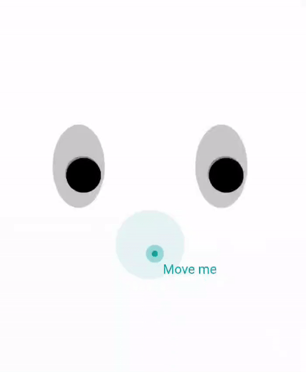
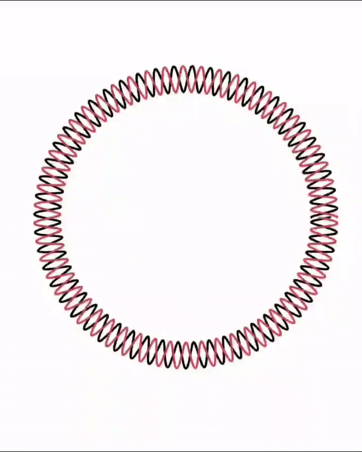
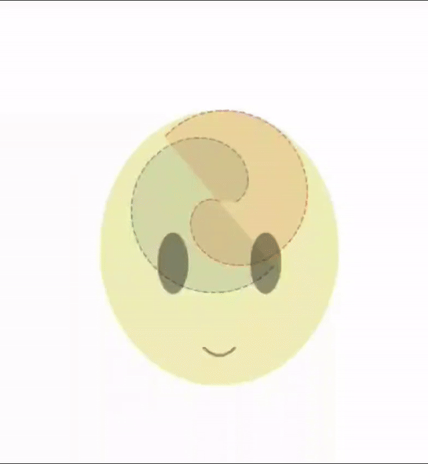

# manim_practice
 This is my journey to practice the Math Animation Library that was originally create by 3Blue1Brown and currently maintained by the `manim` community. My interest in learning this library started from my hobby of creating desmos art and animations.

While creating Desmos art I started loving the art that can be created with mathematical functions and wanted to explore it further. For example, here are the snippets of some of my creations in desmos:

|Animation | Main Idea |
| ------- | ----------|
|  |  Creating non linear constraints for a function and working with interactive elements in Desmos |
| | using polar coordinates I learned to create a circular object rotating with constant angular velocity|
| | using the same idea of polar coordinates to rotate more complex shape|

I wanted to take these ideas I have learned and apply it to `manim`. Currently I have only learned the basic transformations but will use it to create similarly more interesting projects in the future.

# My simple `manim` animations:

 Currently I have learned the following animations

## Text rendering
This is pretty self explanatory
- I have rendered this at half the speed taking 2 seconds per animation rather than 3

## Simple transformations
Here I have created a circle and ran following transformations on it:
1. $(2,2)$ translation of the same circle
2. Scaling it by 0.5 of the same circle
3. changing the color to BLUE
4. changing the opacity to 0.5
- All of these animations were rendered at half the speed 

